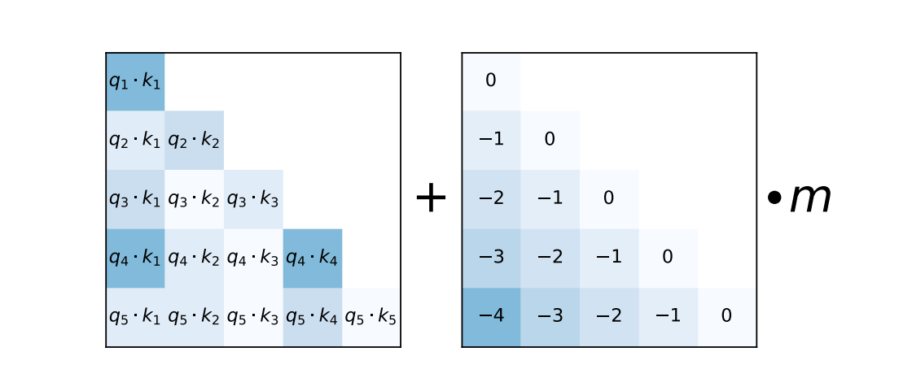

## Attention with Linear Biases
**Non-official** PyTorch implementation of [Train Short, Test Long: Attention with Linear Biases Enables Input Length Extrapolation](https://arxiv.org/pdf/2108.12409.pdf)

The main advantage of this method is that it can be used for any input length, not only for fixed-length inputs. It should be trained over trained max_inputh_length but, we can increase it length just with longer inputs. 
It has simple implementation and is easy to understand. The main idea is the farthest token has less effect on the next token. 

I re-implemented this paper because the official implementation has a complex structure and not easy to follow what algorithm is actually does.

To see and use aLiBi attention [aLiBi](models/alibi_attn.py) click to link on repository.

### Added functionalities
So far, 
- I implement data process and load part and test them with custom and HF Trainer.
- I added generation function with `top_p, top_k, temperaturre` to decoder model. A small update is required for training
- Also, kv_cache added to optimize inference.

### Future works
- Add causal masking for decoder training.
- Add config parsing and loading from HF.
- Add training loop for custom model implementation.

